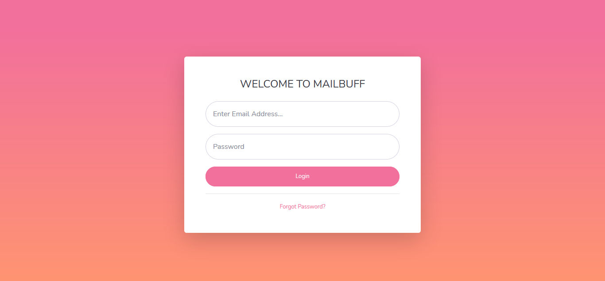
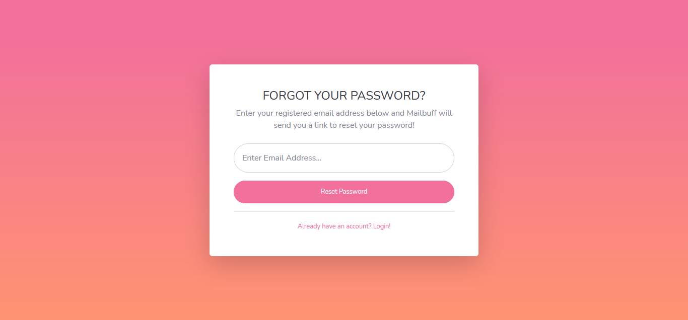
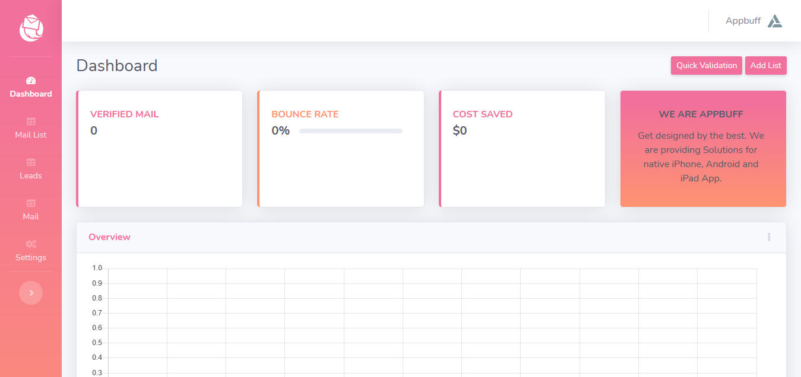

# Mailbuff :rocket:
[](https://opensource.org/licenses/Apache-2.0)
[](https://github.com/appbuff/mailbuff/blob/master/licence.txt)

Opensource and Professional Mail Verification Solution.

The idea of Mailbuff has been came from our own needs. Every company like [Appbuff](https://appbuff.net) use Email marketing services to get more business needs. We collect mail address in various ways or resources. Bad things, we normally cant check which mail ID is valid and which is not valid. In this case, we get lot of Bounch issues.

We used to use many Free and even premium services to verify Mail ID, such as [VerifyEmailAddress.org](https://www.verifyemailaddress.org/). But problem was, we cant verify in bulk or we cant download all verified mail in bulk or not even in CSV format.

We even purchase many readymade Email verification script, but none of the fullfill our purpose. We needed something very simple but with some advance features.

After spending some time, we come with this [Mailbuff](https://github.com/appbuff/mailbuff) solution. :fire: Mailbuff is being used by [Appbuff](https://appbuff.net) Digital Marketing Team adn they are totally satisfied.

## FEATURES :label:

* Quick Mail Scan to verify SIngle Mail ID
* Bulk Mail Scan to verify unlimited Mail ID :mag:
* Import & Export Bulk Email Address from CSV :boom:
* Bulk Mail Send option to check Valid Mail ID
* Send Mail to your verified ID without any other mail Sender System
* System and User profile Setting Options


## REQUIREMENTS :memo:

* Apache/Nginx
* MySQL 5.6+
* PHP 5.6+

Note: You must configure your server properly as a mail server to avoid being blocked or blacklisted. You can check your server using [Mail Tester](https://mail-tester.com).

## Credits
- [Bootstrap](https://getbootstrap.com/)
- [CKEditor](https://ckeditor.com)
- [DropzoneJS](https://www.dropzonejs.com/)
- [SB Admin 2](https://startbootstrap.com/theme/sb-admin-2)
- [Font Awesome](https://fontawesome.com/)
- [Favicon Generator](https://realfavicongenerator.net/)
## Screenshots



## License

```
Copyright 2020 Appbuff LLC

Licensed under the Apache License, Version 2.0 (the "License");
you may not use this file except in compliance with the License.
You may obtain a copy of the License at

   http://www.apache.org/licenses/LICENSE-2.0

Unless required by applicable law or agreed to in writing, software
distributed under the License is distributed on an "AS IS" BASIS,
WITHOUT WARRANTIES OR CONDITIONS OF ANY KIND, either express or implied.
See the License for the specific language governing permissions and
limitations under the License.
```
